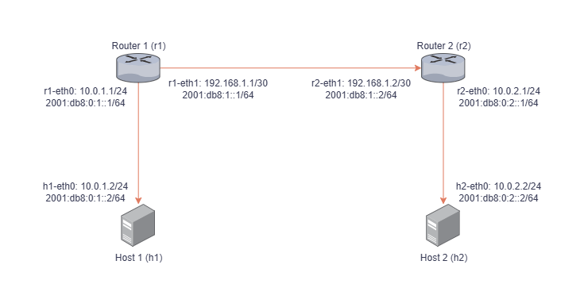
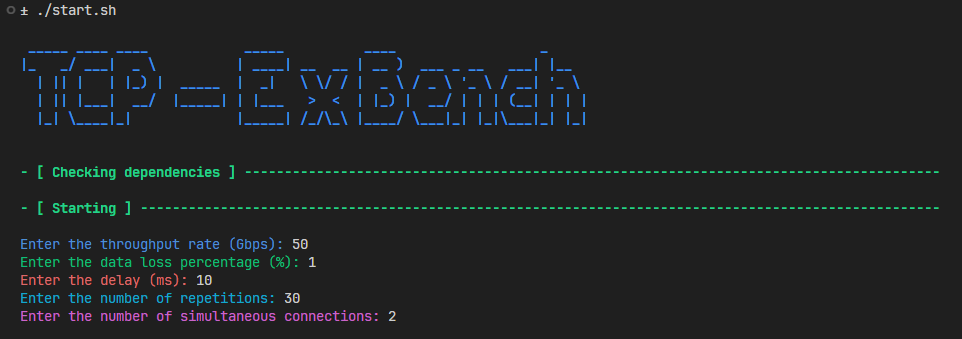

# TCP-ExBench

This project performs a performance analysis of different TCP versions (Reno, Cubic, BBR, Vegas, Veno, and Westwood) in IPv4 and IPv6 networks using a network topology emulated with Mininet. The goal is to evaluate performance metrics such as **Throughput**, **RTT**, **Retransmissions**, **Packet Loss**, and **CPU Usage**.

<br>

## Requirements

- **Python**: Version 3.7 or higher.
- **iPerf3**: Version 3.16 or higher.
- **Linux Terminal**

<br>

## Project Structure

- **script.py**: Main file that implements the topology, runs the tests, and generates the graphs.
- **start.sh**: Initialization script to install dependencies and execute the experiment.
- **dataset**: Folder where test results are saved in CSV format.
- **output**: Folder containing the complete output of all iperf executions.
- **graphs**: Folder with the generated graphs for the analyzed metrics, including averages and confidence intervals.
- **tables**: Folder containing tables with descriptive statistics generated from the test results saved in CSV.

<br>

## Features

1. **Automatic Installation**:
   - When running the `start.sh` script, all required dependencies will be automatically installed.

2. **Network Topology**:
   - The Python script creates a network topology with 2 routers and 2 hosts configured for both IPv4 and IPv6.
   - The figure below shows the network topology used in this experiment:

   <br>
    <p align="center">
        
    </p>
   <br>

3. **Parameter Input**:
    - The user must provide the following configurations when starting the Python script:
      - **Throughput (Gbps):** Maximum transmission rate on the links.
      - **Delay (ms):** Link delay time.
      - **Packet Loss (%):** Packet loss percentage.
      - **Number of repetitions:** Number of times the tests will be executed.
<br>

4. **Result Storage**:
   - **dataset**: Test results in CSV format.
   - **output**: Detailed logs of all iperf executions.
   - **graphs**: Performance metric graphs organized into subfolders.
   - **tables**: Tables with test results saved in CSV format.

<br>

## How to Use

1. **Run the Initialization Script**:
   ```bash
   ./start.sh
   ```
   This command:
   - Installs the required dependencies (Python, Mininet, libraries, etc.).
   - Automatically starts the Python script.

2. **Provide the Requested Parameters**:
   - During execution, enter the values for network and test configurations when prompted by the terminal.
   - Enter whole numbers only.

    <br>
     <p align="center">
        
     </p>
    <br>

   - The figure above illustrates an example of data input for the experiment. The provided values correspond to the following example scenario:
   <br>
   
         Throughput: 50 Gbps  
         Packet Loss: 1%  
         Delay: 10 ms  
         Repetition of tests: 30
         Simultaneous connections: 2

   - Note:
     - It is recommended that you enter at <i>least the value 3</i> for the <b>Number of Repetitions</b> input;
     - In <b>Simultaneous connections</b>, setting at least a value of 1 for the connections established between the hosts is recommended.

3. **Track the Progress**:
   - The experiment execution will create files in the `dataset/` folder and logs in the `output/` folder.

4. **View the Results**:
   - The graphs and tables will be generated and saved in the `graphs/` and `tables/` folders.

<br>

## Analyzed Metrics

- **Throughput (Gbps):** Data transmission rate.
- **RTT (ms):** Round-trip time of packets.
- **Retransmissions:** Number of packet retransmissions.
- **Packet Loss (%):** Percentage of lost packets.
- **CPU Usage (%):** Average CPU usage during the tests.

<br>

---

**Note:** Ensure that the script is executed in an environment with proper permissions for using emulated networks.